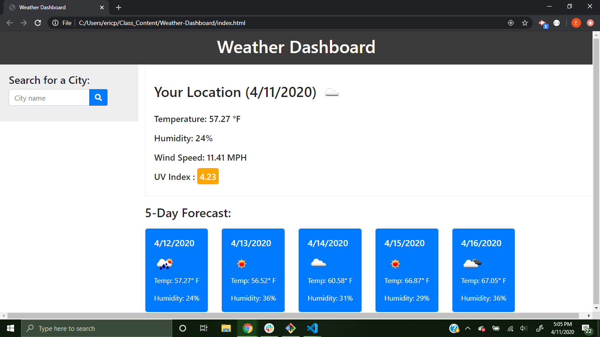

# Weather-Dashboard
Homework 6 -> A dashboard featuring the current weather and a 5 day forecast of a selected city.
## Link to the dashboard
https://eric-purrington.github.io/Weather-Dashboard/

## Start Page

## How it works
On the first visit of the site, the window will prompt the user to get their location. If allowed, their location's current weather and 5-day forecast will appear; if blocked, the chosen city of Seattle's weather will appear. The user can then search for new cities which will show their weather. The cities will be saved in local storage to be seen again.   

## Languages used
Used the classic three (HTML, CSS, and JS/jQuery) to create this dashboard.
### HTML
HTML provides the wireframe for the site.
### CSS
CSS gives some needed refurbishing to the bootstrap used.
### JavaScript/jQuery
The scripts give the buttons functionality and provides the ajax calls needed to get the weather. 

## Tech used from others   
https://getbootstrap.com/                                   
https://fontawesome.com/                                          
https://cdnjs.com/libraries/jquery                                               
https://momentjs.com/                                                       
https://meyerweb.com/eric/tools/css/reset/